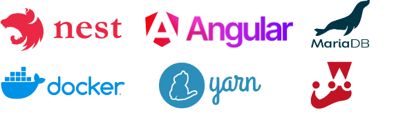

# Testowanie i jakość oprogramowania

## Autor
Kajetan Nowak

## Temat projektu
Aplikacja gym-fit

## Opis projektu
...

## Uruchominie projektu
*via docker-compose*

1. Przejdź do folderu `docker/`
2. Uruchom komendę `docker compose up -d`
3. Aplikacja webowa dostępna jest pod http://localhost:3002/

*dev*

1. Uruchom bazę danych poprzez komendę `docker run --name mariadb-gym-fit -e MARIADB_ROOT_PASSWORD=password -e MYSQL_DATABASE=gym-fitness -p 3306:3306 -d mariadb`
2. W folderach `frontend/` oraz `backend/` uruchom polecenie `yarn && yarn start`
3. Aplikacja webowa dostępna jest pod http://localhost:4200/, a dokumentacja API (Swagger.io) pod http://localhost:3000/api/

## Opis testów
### Jednostkowe
opis testów jednostkowych
[Test](backend/src/auth/auth.controller.ts)
### Integracyjne
opis testów integracyjnych

## Przypadki testowe dla testera manualnego

## Technologie użyte w projekcie

