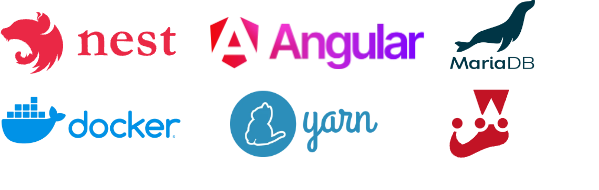

# Testowanie i jakość oprogramowania

## Autor
Kajetan Nowak

## Temat projektu
Aplikacja gym-fit

## Opis projektu
***Aplikacja webowa Gym fit ma na celu dostarczenie użytkownikom informacji o treningach w danym obiekcie sportowym.*** \
Użytkownik, który chce zapisać się na dany trening musi zarejestrować się podając swoje dane osobowe, adres e-mail, hasło oraz, opcjonalnie, preferencje w typie treningów. Zalogowany użytkownik ma dostęp do treningów, na które się zapisał. \
Trener, chcąc dodać lub zarządzać swoimi treningami musi utworzyć konto podając swoje dane osobowe, adres e-mail, hasło oraz być zalogowanym w systemie. Ma możliwość dodawania treningu podając nazwę, typ oraz datę treningu i opcjonalnie ilość dostępnych miejsc, aktualizacji danego treningu oraz jego usunięcia. Trenerzy nie mają możliwości zapisywania się na swoje lub inne treningi. \
Administrator systemu musi zalogować się na fabrycznie ustawione dane - adres e-mail oraz hasło. Ma dostęp do wszystkich funkcji systemu oraz dodatkowo panelu administratora, z którego ma możliwość zarządzania użytkownikami i trenerami w systemie (blokowanie, usuwanie użytkowników etc.)

## Uruchomienie projektu

| Typ konfiguracji        | Kroki                                                                                                        |
|-------------------|--------------------------------------------------------------------------------------------------------------|
| **Docker Compose** | 1. Przejdź do folderu `docker/`  2. Uruchom komendę `docker compose up -d`  3. Aplikacja webowa dostępna jest pod [http://localhost:3002/](http://localhost:3002/) |
| **Dev Setup**     | 1. Uruchom bazę danych poprzez komendę `docker run --name mariadb-gym-fit -e MARIADB_ROOT_PASSWORD=password -e MYSQL_DATABASE=gym-fitness -p 3306:3306 -d mariadb`  2. W folderach `frontend/` oraz `backend/` uruchom polecenie `yarn && yarn start`  3. Aplikacja webowa dostępna jest pod [http://localhost:4200/](http://localhost:4200/), a dokumentacja API pod [http://localhost:3000/api/](http://localhost:3000/api/) |

## Opis testów
### Jednostkowe
Testy jednostkowe zostały zdefiniowane w plikach `.spec.ts` w folderach `gym-users` weryfikujące poprawne działanie metod związanych z operacjami na danych użytkowników oraz `trainings` - operacje na danych treningów.

*Gym-users*
- [Pobieranie użytkowników](backend/src/gym-users/gym-user.controller.spec.ts#L56) - pobranie wszystkich użytkowników systemu
- [Pobieranie użytkowników po roli](backend/src/gym-users/gym-user.controller.spec.ts#L67) - pobranie użytkowników po roli z wykorzystaniem parametryzacji argumentu role
- [Zapisanie użytkownika na trening](backend/src/gym-users/gym-user.controller.spec.ts#L83) - zapisanie użytkownika na dany trening, rezultat - lista użytkowników danego treningu zawiera nowego użytkownika 
  
*Trainings*
- [Pobranie treningów](backend/src/trainings/training.controller.spec.ts#L72) - pobranie wszystkich treningów w systemie
- [Pobranie treningów po nazwie](backend/src/trainings/training.controller.spec.ts#L81) - pobranie treningów spełniających filtry wyszukiwania po nazwie treningu
- [Pobranie treningów po typie treningu](backend/src/trainings/training.controller.spec.ts#L93) - pobranie treningów spełniających filtry wyszukiwania po typie treningu
- [Pobranie treningów po nazwie oraz typie treningu](backend/src/trainings/training.controller.spec.ts#L105) - pobranie treningów spełniających oba filtry wyszukiwania - po nazwie oraz typie treningu
- [Dodanie nowego treningu](backend/src/trainings/training.controller.spec.ts#L118) - dodanie nowego treningu przez trenera
- [Aktualizacja treningu](backend/src/trainings/training.controller.spec.ts#L141) - aktualizacja treningu o nazwę, datę oraz typ treningu

### Integracyjne
Testy integracyjne zostały zdefiniowane w plikach `.ispec.ts` w folderach `test/users` oraz `test/trainings`. Dodatkowo plik `fixtures.ts` zawiera predefiniowane dane, które są używane w żądaniach i odpowiedziach HTTP. W folderze `mocks` zdefiniowane są atrapy guardów - auth oraz roles. W pliku `setup.ts` tworzony jest dynamicznie kontener bazy danych, a w pliku `teardown.ts` jest on niszczony.

*Gym-users*
- [Pobranie wszystkich użytkowników](backend/test/users/users-retrieving.ispec.ts#L33) - żądanie HTTP pod endpoint /users powinno zwrócić status 200 oraz wszystkich użytkowników
- [Pobranie użytkowników po roli](backend/test/users/users-retrieving.ispec.ts#41) - żądanie HTTP pod endpoints /users?role= powinno zwrócić status 200 oraz użytkowników spełniających warunki filtrów
- [Zapisanie na trening](backend/test/users/users-manipulation.ispec.ts#L69) - żądanie HTTP pod endpoint /users/:email/training/:trainingId z ważnym JWT powinno zwrócić status 200 oraz dane związane z treningiem oraz użytkownikami

*Trainings*
- [Pobranie wszystkich treningów](backend/test/trainings/trainings-retrieving.ispec.ts#L42) - żądanie HTTP pod endpoint /trainings powinno zwrócić status 200 oraz wszystkie treningi
- [Pobranie treningów po nazwie](backend/test/trainings/trainings-retrieving.ispec.ts#L50) - żądanie HTTP pod endpoint /trainings?name= powinno zwrócić treningi spełniające wymagania filtra wyszukiwania po nazwie treningu
- [Pobranie treningów po nazwie oraz typie](backend/test/trainings/trainings-retrieving.ispec.ts#L60) - żądanie HTTP pod endpoint /trainings?name=&workoutType= powinno zwrócić treningi spełniające wymagania filtra po nazwie oraz typie
- [Pobranie treningów po typie](backend/test/trainings/trainings-retrieving.ispec.ts#L70) - żądanie HTTP pod endpoint /trainings?workoutType= powinno zwrócić treningi spełniające wymagania filtra wyszukiwania po typie treningu
- [Dodanie nowego treningu](backend/test/trainings/trainings-manipulation.ispec.ts#L57) - żądanie HTTP pod endpoint /training z ważnym JWT powinno zwrócić status 201 i nowo dodany trening
- [Dodanie nowego treningu z niepoprawnym JWT](backend/test/trainings/trainings-manipulation.ispec.ts#L81) - żądanie HTTP pod endpoint /training z błędnym JWT powinno zwrócić status 403
- [Aktualizacja treningu](backend/test/trainings/trainings-manipulation.ispec.ts#L95) - żądanie HTTP pod endpoint /trainings/:trainingId powinno zwrócić status 200 oraz zaktualizować trening
- [Usuwanie treningu](backend/test/trainings/trainings-manipulation.ispec.ts#L108) - żądanie HTTP pod endpoint /trainings/:trainingId powinno zwrócić status 200 oraz usunąć trening

## Przypadki testowe dla testera manualnego

| ID         | Tytuł                                     | Warunki początkowe                                | Kroki testowe                                                                                          | Oczekiwany rezultat                                           |
|------------|--------------------------------------------|--------------------------------------------------|-------------------------------------------------------------------------------------------------------|-------------------------------------------------------------|
| TC_001     | Rejestracja użytkownika                   | Otwarta strona pod adresem `http://localhost:4200/register` | 1. Wybierz zakładkę User   2. Wpisz imię w polu Name   3. Wpisz nazwisko w polu Surname   4. Wpisz adres email w polu Email   5. Wpisz hasło w polu Password   6. Naciśnij przycisk Register | Nowy użytkownik jest zarejestrowany.                        |
| TC_002     | Rejestracja użytkownika - zdublowany email | Otwarta strona pod adresem `http://localhost:4200/register` | 1. Wybierz zakładkę User   2. Wpisz imię w polu Name   3. Wpisz nazwisko w polu Surname   4. Wpisz ten sam adres email w polu Email jak w TC_001   5. Wpisz hasło w polu Password   6. Naciśnij przycisk Register | W prawym górnym rogu wyświetla się toast “Email (adres email) is already in use.” |
| TC_003     | Próba zapisania użytkownika na trening bez autoryzacji | Otwarta strona pod adresem `http://localhost:4200/trainings`, użytkownik nie jest zalogowany w aplikacji | 1. Naciśnij przycisk Assign to training | W prawym górnym rogu wyświetla się toast “You have to login first.” |
| TC_004     | Zapisanie użytkownika na trening          | Otwarta strona pod adresem `http://localhost:4200/trainings`, użytkownik posiada konto w aplikacji, użytkownik jest zalogowany w aplikacji | 1. Naciśnij przycisk Assign to training | W prawym górnym rogu wyświetla się toast “Assigned to training” i liczba dostępnych miejsc zmniejsza się o 1. |
| TC_005     | Próba zapisania użytkownika na trening - istniejąca relacja użytkownik-trening | Otwarta strona pod adresem `http://localhost:4200/trainings`, użytkownik posiada konto w aplikacji, użytkownik jest zalogowany w aplikacji | 1. Naciśnij przycisk Assign to training | W prawym górnym rogu wyświetla się toast “User already assigned to this training.” |
| TC_006     | Rezygnacja użytkownika z treningu         | Otwarta strona pod adresem `http://localhost:4200/trainings/user`, użytkownik posiada konto w aplikacji, użytkownik jest zalogowany w aplikacji | 1. Naciśnij przycisk Resign   2. W komunikacie z przeglądarki “Do you want to leave this training?” naciśnij przycisk OK | Trening usunięty z listy użytkownika.                       |
| TC_007     | Logowanie trenera                         | Otwarta strona pod adresem `http://localhost:4200/login`, użytkownik posiada konto trenera w aplikacji | 1. Wybierz zakładkę Trainer   2. Wpisz adres email   3. Wpisz hasło   4. Naciśnij przycisk Login | Access token zapisany do local storage oraz przekierowanie na stronę `http://localhost:4200/`, w prawym górnym rogu wyświetla się toast “Successfully logged in as trainer.” |
| TC_008     | Dodanie treningu przez trenera            | Otwarta strona pod adresem `http://localhost:4200/trainings/manage`, użytkownik posiada konto w aplikacji, użytkownik jest zalogowany w aplikacji według TC_007 | 1. Wybierz zakładkę Add training   2. Wpisz nazwę treningu w polu Name   3. Wybierz typ treningu z rozwijanej listy w polu Workout type   4. Wybierz datę treningu w polu Date   5. Wpisz opcjonalnie maksymalną liczbę uczestników w polu Max persons   6. Naciśnij przycisk Add training | W prawym górnym rogu wyświetla się toast “Training added successfully.” |
| TC_009     | Aktualizacja treningu przez trenera       | Otwarta strona pod adresem `http://localhost:4200/trainings/manage`, użytkownik posiada konto w aplikacji, użytkownik jest zalogowany w aplikacji według TC_007 | 1. Wybierz zakładkę Manage trainings   2. Wybierz dowolny trening naciskając przycisk Update   3. Zmień nazwę treningu w polu Name   4. Zmień typ treningu w polu Workout type   5. Zmień datę treningu w polu Date   6. Zmień/dodaj maksymalną liczbę uczestników w polu Max persons   7. Naciśnij przycisk Save | Dane treningu są zaktualizowane.                           |
| TC_010     | Usuwanie treningu przez trenera           | Otwarta strona pod adresem `http://localhost:4200/trainings/manage`, użytkownik posiada konto w aplikacji, użytkownik jest zalogowany w aplikacji według TC_007 | 1. Wybierz zakładkę Manage trainings   2. Wybierz dowolny trening naciskając przycisk Delete   3. W komunikacie przeglądarki “Are you sure you want to delete this training?” naciśnij przycisk OK | Trening został usunięty z listy treningów.                  |

## Technologie użyte w projekcie

